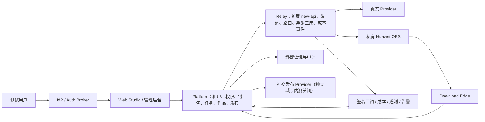

# AI-video 服务器内测整改与验收表单

版本：2026-08-21

适用范围：`AI-video` 客户 Platform、扩展版 `new-api` Relay、Huawei OBS、Download Edge 及其外部依赖

当前实际决策：**NO-GO**。可以先搭建“仅运维人员可见”的服务器整改环境，但在第 20 节对应门禁全部 PASS 并签字前，不得向测试用户开放 `PILOT-A` 或 `PILOT-B`；公网商用继续 NO-GO。

> 这不是一份“打勾就上线”的形式文档，而是一份部署记录、整改清单和验收证据索引。每次部署复制一份，填写实际值并由不同人员复核。
>
> **严禁在本文、工单、截图、终端历史或 Git 中填写真实密码、AK/SK、Bearer Token、Cookie、签名 URL、OAuth Token 或私钥。**“Secret 引用”只填写密钥管理器中的路径、版本或工单编号。

## 1. 先选本次内测范围

| 方案 | 能做什么 | 必须关闭什么 | 当前建议 |
| --- | --- | --- | --- |
| `PILOT-A` 工程内测 | 登录、权限、Platform/Relay 管理、钱包测试余额、Mock/契约测试 | 真实 Provider、真实支付、真实社交发布、真实客户素材 | 可用于先部署服务器和验证基础设施 |
| `PILOT-B` 真实生成内测 | 在 `PILOT-A` 基础上，只开放 1 个真实 Provider、1 个低成本模型、私有 OBS 和 Download Edge | 真实支付、真实社交发布、普通公网访问 | **本次建议目标** |
| `PROD` 公网商用 | 面向真实客户收费并承诺可用性 | 无临时豁免 | 当前禁止 |

本次选择：

- [ ] `PILOT-A`
- [ ] `PILOT-B`
- [ ] `PROD`（当前不得勾选）

## 2. 系统链路和责任边界



边界原则：

- 浏览器只调用 Platform，不能持有 Relay 服务凭据。
- Platform 管客户、公司、权限、报价、钱包、任务、作品和发布。
- Relay 管真实生成渠道、Provider 凭据、路由、账号池、异步执行、产物转存、Provider 成本和故障恢复。
- 社交发布不属于 Relay；它是 Platform 的独立业务域。
- `new-api /channels` 是高风险 break-glass 管理面，不是客户页面，也不能代替 Platform 权限边界。

## 3. 表单状态和判定规则

| 状态 | 含义 |
| --- | --- |
| `NOT_STARTED` | 尚未执行 |
| `IN_PROGRESS` | 正在整改，不能作为 PASS |
| `BLOCKED` | 缺凭据、外部系统、权限或明确失败 |
| `PASS` | 已按当前候选版本执行并有可核验证据 |
| `WAIVED` | 有书面例外和到期日；不得用于身份隔离、密钥泄漏、真实收费、跨租户、账务、真实 Provider/OBS 完整性等 P0/P1 门禁 |

最终决策：

- `PILOT-A GO` / `PILOT-B GO`：仅允许对应的白名单内测范围。
- `PROD-GO`：全部商用门禁闭合；当前不可选。
- `NO-GO`：任一必需门禁未通过，或证据与候选镜像不绑定。

## 4. 本次发布身份表

| 字段 | 填写值 |
| --- | --- |
| 环境名称 | `________________` |
| 部署日期（UTC） | `________________` |
| 部署负责人 | `________________` |
| 安全负责人 | `________________` |
| 业务负责人 | `________________` |
| 值班负责人/联系方式 | `________________` |
| Platform 公网/内网域名 | `________________` |
| Relay API 域名 | `________________` |
| Relay Admin 独立域名 | `________________` |
| Download Edge 域名 | `________________` |
| 根仓库 commit | `________________` |
| new-api upstream revision | `________________` |
| 发布 tag | `________________` |
| Relay 镜像 digest | `sha256:________________` |
| Platform 迁移 head | 必须为 `0040_showcase_management` |
| Platform direct predecessor | 必须为 `0039_new_api_relay_defaults` |
| Platform download-evidence predecessor | 必须保留 `0038_download_evidence_checks` |
| Platform auth predecessor | 必须保留 `0037_production_auth_lifecycle` |
| Platform protected v5 catalog | 必须为 `ecd5b3faae20595e66396c59d37327d1e6e5b742c3d70697aaf6f109866591e6` |
| 活动生产 Relay | 必须为 `new-api-v1 / generations.v1`，且受保护配置中只能有这一个 backend |
| 候选源码 snapshot SHA-256 | `________________` |
| Platform snapshot SHA-256 | `________________` |
| 验收 harness snapshot SHA-256 | `________________` |
| 证据根目录 | `artifacts/server-pilot/________________/` |
| 本次结论 | `NO-GO / PILOT-A GO / PILOT-B GO / PROD-GO` |

说明：`backend/new-api-relay` 使用受版本约束的 Go/GORM 数据库发布合同，没有 Alembic
head；不能把离线 Python oracle 的 `0012` 写成 new-api 迁移版本或生产依赖。

### 4.1 服务器与外部资源清单

| 资源 | 实际值或资产 ID（不得填 secret） | 验收状态 |
| --- | --- | --- |
| 云厂商/账号/项目 | `________________` |  |
| Region / Availability Zone | `________________` |  |
| 主机 OS / kernel | `________________` |  |
| CPU / RAM / 数据盘容量 | `________________` |  |
| Docker Engine / Compose 版本 | `________________` |  |
| 主机加固基线/补丁日期 | `________________` |  |
| NTP/时间同步状态 | `________________` |  |
| Platform PostgreSQL 实例/版本 | `________________` |  |
| new-api PostgreSQL 实例/版本 | `________________` |  |
| Redis 实例/版本/AOF | `________________` |  |
| Secret Manager / KMS 资产 | `________________` |  |
| OBS bucket、region、输入/输出前缀 | `________________` |  |
| IdP tenant/client | `________________` |  |
| Provider staging account/channel/route ID | `________________` |  |
| DNS zone / TLS certificate ID | `________________` |  |
| VPN/IAP/IP allowlist policy ID | `________________` |  |
| 出站域名 allowlist | `________________` |  |
| 集中日志/指标平台 | `________________` |  |
| 外部告警 sink / on-call schedule | `________________` |  |
| 备份策略/异地副本位置 | `________________` |  |
| 数据保留与自动清理策略 | `________________` |  |

时间必须由可信 NTP 同步；HMAC、JWT、step-up、租约、幂等回执和下载 proof 都依赖可靠时钟。时钟偏差超出当前签名/验收窗口即 `NO-GO`。

## 5. 当前已知状态（部署前必须重新确认）

| 门禁 | 当前仓库状态 | 当前结论 |
| --- | --- | --- |
| 自动化工程门禁 | 当前共享工作树只有聚焦回归，尚未在最终 commit 上完成根 CI、Platform、new-api、跨服务成本与构建全集 | `IN_PROGRESS` |
| 候选来源基线 | `artifacts/relay-candidate-current.json` 可冻结源码来源，但该文件按设计固定为 `UNVERIFIED`、gates=`NOT_RUN`，**不能单独充当上线批准** | `需配套运行证据` |
| 正式 IdP | 项目内 OIDC Code+PKCE、RS256/JWKS、BFF 会话、邀请和账号生命周期已实现；目标 IdP 与真实域名 canary 尚未提交 | `BLOCKED（外部验收）` |
| 真实 Provider | 最新 create/finalize 报告仍在 preflight 阶段因外部凭据/连接缺失而 `BLOCKED` | `BLOCKED` |
| OBS live | 工程已实现，但 `artifacts/relay-obs-live-acceptance` 当前没有 PASS 文件 | `BLOCKED` |
| 支付 | 钱包账务闭环存在；真实支付订单/回调/退款/对账不存在 | 内测必须 `OFF` |
| 社交发布 | 只有 Mock/插件契约，没有 production-ready 官方 OAuth Adapter | 内测必须 `OFF` |
| 监控、备份和 Admin Ingress | 代码/Compose 契约已有，尚缺服务器真实部署、告警接收和恢复演练证据 | `IN_PROGRESS` |
| Git/发布 | 根仓库存在，但当前共享工作树有未提交变更，尚无绑定最终 source snapshot、CI、签名 tag 与 immutable registry digest 的发布记录 | `BLOCKED` |

仓库中的旧测试计数、candidate hash 和本地跨服务成本文件都只是历史参考，不绑定当前
共享工作树。当前 `artifacts/relay-candidate-current.json` 在最终提交完成前必须视为 stale；
禁止在表单预填“通过”。发布负责人应在 clean commit 上依次运行 CI、
`npm run relay:candidate:write`、`npm run relay:candidate:check` 和当前验收脚本，把新生成的
secret-free snapshot/hash 与 immutable image digest 填入本次证据索引。本地 PostgreSQL/Redis
PASS 仍不证明真实 Provider 账单、真实 OBS、目标 IdP、支付或外部值班链路。

### P0：先轮换本地遗留 OBS 凭据

若工作区或历史备份中存在 `deploy/secrets/huawei-obs.runtime.env`，不要打开、复制、打印或把
它附到工单；直接按“可能暴露”处理。本文不把文件存在与否当作已核验证据：

- [ ] 在 Huawei IAM 中禁用/删除旧 AK/SK。
- [ ] 检查旧身份最近调用记录和异常来源。
- [ ] 创建最小权限的新 staging 身份，并记录 Secret Manager 引用：`________________`。
- [ ] 检查日志、镜像层、Git 历史和备份中是否出现旧值；证据：`________________`。
- [ ] 在确认新凭据可用后删除本地遗留文件和临时副本。
- [ ] 复核人确认未在表单、命令历史或日志中复制任何值：`________________`。

**这一步未完成，G-OBS 和真实 Provider 内测必须保持 `BLOCKED`。**

## 6. 内测全局安全开关

部署前全部勾选：

- [ ] 入口只允许 VPN、IAP 或精确 IP 白名单，不向普通公网开放。
- [ ] 仅使用测试公司、测试用户、测试余额和非敏感素材。
- [ ] 充值只允许平台所有者写入“测试余额”，备注明确“内测/非现金”。
- [ ] 真实支付按钮、支付回调和公司自助充值均关闭。
- [ ] `PUBLISHING_WORKER_ENABLED=false`；不配置真实社交发布 OAuth。
- [ ] `feature.auto_publish` 对所有内测公司关闭。
- [ ] 真实 Provider 只允许 1 个 staging 账号、1 个模型/模式、并发 1、明确 RPM/日预算上限。
- [ ] 保留 Provider kill switch，发生异常可立即阻止新准入。
- [ ] Python Relay 只作为隔离、无生产凭据的历史行为 oracle artifact；任何受保护 Compose、Platform backend map、生产 DNS/Ingress 或回滚计划都不能给它生产准入。
- [ ] 所有 Secret 仅由 Secret Manager 临时渲染；宿主文件最小 ACL，部署后销毁。
- [ ] 服务器不得现场修改源码，不使用 `latest` 镜像。

## 7. 总问题整改总表

| ID | 问题 | 服务器内测方案 | 正式商用方案 | 当前状态 | 负责人 | 截止日 | 证据 |
| --- | --- | --- | --- | --- | --- | --- | --- |
| G-IDP | 目标 IdP 尚无当前候选绑定的真实 canary | 直接部署 Platform 原生 OIDC Code+PKCE/BFF；不再增加临时 Auth Broker | 验证 redirect、JWKS 轮换、WebAuthn step-up、邀请、吊销和停用联动 | `BLOCKED（外部验收）` |  |  |  |
| G-PROVIDER | 无当前候选绑定的真实 create/finalize PASS | 1 个官方 Provider 低成本 canary，完整走 Platform→Relay→OBS→成本 | 多路由 production-ready、账单自动对账、灰度发布 | `BLOCKED` |  |  |  |
| G-OBS | 无真实私有桶和 Download Edge PASS；且有遗留凭据文件 | 先轮换，再建最小权限 staging 桶/前缀并跑 live gate | KMS/STS、生命周期、备份、内容安全、多副本 Edge | `BLOCKED` |  |  |  |
| G-PAY | 无真实支付订单、回调、退款、对账 | 完全关闭真实收款，只发测试余额 | Payment order/webhook/refund/reconciliation 状态机 | `OFF` |  |  |  |
| G-PUBLISH | 无真实 Publisher OAuth/Adapter | 功能和 Worker 全关；只保留历史安全操作 | 官方 OAuth、加密 token、刷新/吊销、unknown reconciliation | `OFF` |  |  |  |
| G-OPS | 无服务器监控、备份恢复、受保护 Admin Ingress 实证 | 配真实告警 sink、受限 admin 域、做一次恢复演练 | 24×7 值班、PITR、DR、IAP/MFA、周期演练 | `IN_PROGRESS` |  |  |  |
| G-GIT | 无根 commit/tag、扩展源码未形成审计发布 | 建私有根仓库，普通文件追踪 new-api，CI 构建 digest | 受保护 tag、SBOM、签名、provenance、同 digest 晋级 | `BLOCKED` |  |  |  |

## 8. G-IDP：正式身份认证

### 为什么仍是门禁

Platform 已原生实现 OIDC Authorization Code + PKCE、浏览器绑定且单次消费的 `state`、`nonce`、RS256/JWKS `kid` 轮换、`issuer/aud/azp` 校验、服务端可撤销 BFF Cookie、全局 Origin/CSRF、邀请激活、外部身份映射、全局账号状态、单设备/全设备吊销和 owner step-up。密码、恢复、MFA 与 passkey 明确由 IdP 管理。剩余问题不是代码中没有登录系统，而是目标 IdP、真实域名、TLS、策略和事件联动尚无当前候选的实机证据。

### 内测整改

- [ ] 部署独立 HTTPS OIDC IdP，仅允许测试员/VPN；注册 PKCE public client，不配置 client secret。
- [ ] 精确配置 issuer、authorization/token/JWKS 端点、client ID、Platform callback、Frontend Origin 与 IdP account-management URL。
- [ ] IdP 签发带稳定 `sub`、已验证 email、`nonce`、`iat/exp` 的 RS256 ID token；未知 `kid` 只允许受控刷新一次。
- [ ] owner 实际完成 Passkey/WebAuthn，IdP 原样签发已验证的 `amr/auth_time`，不得由代理伪造。
- [ ] 生产浏览器不保存 Bearer；`__Host-ai_video_session`/`__Host-ai_video_csrf` 属性、Origin 和双提交 CSRF 全部实测。
- [ ] 邀请激活、换 IdP 账号、单设备吊销、全设备退出、全局 suspend/reactivate、离职 membership disable 和 owner transfer 全部走真实会话。
- [ ] IdP 账号停用与 Platform 全局停用的运维联动有责任人、SLA 和审计事件；本地密码/找回 UI 不得伪装存在。

### 商用整改

Platform/BFF 当前使用固定且严格校验的 OIDC HTTPS 端点、PKCE S256 与 RS256 JWKS；每次回调读取 JWKS，遇到未知 `kid` 时仅额外刷新一次并再次验签。它使用 `HttpOnly + Secure + SameSite=Lax` 服务端会话，不向浏览器发长期 refresh token，并建立 `(issuer, sub)` 映射、邀请激活、个人/公司上下文、离职禁用和全局吊销；MFA、passkey、密码与恢复由目标 IdP 提供并通过 account-management URL 进入。

### 验收清单

- [ ] 合法成员只能进入授权公司。
- [ ] 错 issuer/audience/azp/signature/alg/kid/exp/nbf/sub/nonce 全部拒绝；state 跨浏览器、重放或 callback 前换值也拒绝。
- [ ] 跨公司和停用成员返回 403/404，不泄露对象存在。
- [ ] owner 的 WebAuthn `amr` 且 `auth_time≤300s` 才能写；陈旧认证返回 `X-Auth-Required: step-up`。
- [ ] code/state/session/CSRF/邀请 token 不出现在持久 URL、HTML、日志、截图、`localStorage` 或生产 `sessionStorage`；邀请 fragment 进入内存后立即清 URL。
- [ ] 登出、禁用、离职在约定 SLA 内失效。
- [ ] JWKS 轮换和旧 key 撤销演练通过。

证据字段：`issuer / discovery SHA-256 / signing alg / kid fingerprint / client_id / redirect_uri / token TTL / tester subject SHA-256 / company_id / amr / auth_time / request_id / IdP event_id / Platform audit_id / 截图 SHA-256`。

状态：`________`　负责人：`________`　复核人：`________`　证据：`________`

## 9. G-PROVIDER：真实 Provider create/finalize

### 为什么是问题

项目已经实现真实渠道验收 CLI，但最近一次报告仍为 preflight `BLOCKED`。本地 Mock、接口契约、单元测试或成本合同测试，都不能证明真实 Provider 账号、真实账单和真实产物链路正确。

已知 BLOCKED 报告：

`artifacts/relay-real-channel-acceptance/real-channel-20260807T041609Z-d9ee23e4-61d5-49e1-a44f-c0de27fe1377/report.json`

### 内测整改

- [ ] 只创建 1 个官方 Provider staging 账号和 new-api Channel。
- [ ] 在受保护的原生 `/channels` 控制台录入凭据；表单只记 channel ID 和 key fingerprint。
- [ ] 只声明 1 个固定 route、1 个低成本 model/mode；并发 1、RPM 和日预算硬限额。
- [ ] 先完成 OBS/Download Edge，再创建真实任务。
- [ ] 必须由 Platform 创建新任务，不能直接调 Relay，也不能复用旧 task。
- [ ] 依次执行 `preflight → create`。
- [ ] create checkpoint 后重新申请一个更晚的下载 ticket，由真实 Edge 完整传输。
- [ ] 准备 Provider 原始账单/合同文件哈希和独立财务 Ed25519 审批。
- [ ] 执行 `finalize`；只有 final report=`PASS` 才算闭环。

### 商用整改

每个 `provider + channel + model + mode + resolution` 单独认证 production-ready；发布不可变 Route Release 与 capability revision；供应商账单通过 API/导出自动对账；配置 Provider monitor、告警、预算熔断、unknown-submission 人工对账和周期 canary；按 0→1%→10%→100% 灰度。同一真实任务永远 sticky 到原 route，未知提交绝不跨 channel 重试。

### 验收清单

- [ ] runtime build identity 与候选 source snapshot/image digest 一致。
- [ ] Platform 创建任务后钱包先 reserve，成功只 settle 一次，失败/安全取消 release。
- [ ] Provider task ID、channel、route、account、key fingerprint 固化。
- [ ] 轮询保持原账号；unknown 保持 hold、原 route 和槽位。
- [ ] 产物必须先经 OBS HEAD 验证 size/MIME/SHA，之后才能成功和结算。
- [ ] 签名 callback 重放幂等，改 body/绑定冲突拒绝。
- [ ] Edge 下载完整字节和 SHA 一致，一次性 ticket 二次使用失败。
- [ ] Provider 账单与 task/job/channel 精确绑定，成本事件 append-only，重放幂等。
- [ ] 成本入账不改客户钱包；缺账单不得把成本当 0。
- [ ] auth、429、5xx、超时、可证明未创建和未知提交分别命中正确策略。

证据字段：`run_id / phase / status / image digest / source snapshot / company/user/task/job/model / capability version / request SHA / provider/channel/route/account/key fingerprint / provider task reference / callback event / reserve-settle ledger IDs / artifact size-MIME-SHA / checkpoint/download proof/bill/approval/final report 路径与 SHA-256`。

状态：`________`　负责人：`________`　财务复核：`________`　证据：`________`

## 10. G-OBS：私有 OBS 与 Download Edge

### 为什么是问题

代码已经实现私有上传、HEAD 校验、一次性下载 ticket、完整传输事件和 Ed25519 proof；但没有当前候选绑定的 live PASS。遗留凭据轮换完成前不得继续。

### 内测整改

- [ ] Platform 输入前缀与 Relay 输出前缀使用不同最小权限身份。
- [ ] 匿名读写关闭，只允许官方 HTTPS endpoint。
- [ ] staging 对象使用服务端加密和短生命周期规则。
- [ ] Relay 身份只可写/HEAD/删自己的 output 前缀。
- [ ] Platform 身份只可管理 input 前缀。
- [ ] Download Edge 不持有 OBS AK/SK，只消费短期签名源 URL。
- [ ] Edge 使用独立 DML-only PostgreSQL role、ticket key、source encryption key、completion HMAC 和 proof key。
- [ ] `allowed OBS hosts` 精确到批准域名，禁止任意 URL/重定向。
- [ ] 运行候选绑定的 OBS live runner。
- [ ] 再随真实 Provider 跑 Platform→Relay→OBS→Edge→Platform completion。

### 商用整改

使用 Secret Manager/KMS、STS 临时凭据和定期轮换；输入/输出 IAM 隔离；对象版本、生命周期、保留、跨域备份与恢复；内容安全/病毒扫描；Download Edge 多副本、WAF、限流、DLQ/延迟告警；OBS 永不公开。

### 验收清单

- [ ] live evidence schema PASS，候选标签、compiled identity 和 source snapshot 全绑定。
- [ ] PUT 后 HEAD 的 size/MIME/metadata SHA 一致。
- [ ] 匿名 GET 失败；签名完整 GET=200 且字节/SHA 一致。
- [ ] 只删除本次测试对象；删除后授权 HEAD=404。
- [ ] Gateway 仅 HTTPS:443 `/downloads/{token}`，无 userinfo/query/fragment/redirect。
- [ ] 无 Range 完整下载，长度/SHA 一致；ticket 二次使用失败。
- [ ] 点击按钮只记 `issued`；完整传输且 Platform 接受签名事件后才是 `completed`。
- [ ] proof 绑定 company/task/artifact/issuance/gateway/object/bytes/SHA/timeline 并验签通过。
- [ ] 故障时任务不提前 success/settle，界面不虚报 downloaded。
- [ ] 慢传、大文件、进程重启和 cleanup fencing 不重复对象、不误删。

证据中只保存 endpoint host、bucket SHA-256、object key、size、MIME、artifact SHA、HTTP 状态、时间线、cleanup 和 proof 摘要；不得保存 raw bucket、AK/SK、security token 或签名 URL。

状态：`________`　负责人：`________`　安全复核：`________`　证据：`________`

## 11. G-PAY：支付和钱包

### 当前边界

钱包已有 64 位整数分、reserve→settle/release、幂等、行锁和追加账本；但“充值”只是平台管理员给内部钱包入账，不是支付订单，也不能称真实现金流。

### 内测方案

- [ ] 不接微信、支付宝、Stripe 或其他真实收款渠道。
- [ ] 生产/内测公司自助充值路由保持关闭。
- [ ] 只有平台所有者可给测试公司增加测试余额。
- [ ] 备注必须包含“内测/非现金”；使用稳定幂等键。
- [ ] 报表把它叫“测试入账/账户充值”，不能叫“真实现金到账”。

### 商用方案

在 Platform 增加 `payment_orders`、`payment_attempts`、`payment_webhook_receipts`、`refunds` 和 `reconciliation`；回调对原始 body 验签、时间窗、防重放，订单/provider event 唯一；金额和币种一致后同事务只追加一次钱包充值；退款/拒付写补偿账本，禁止修改原流水；每日渠道账单对账。

### 验收清单

- [ ] 内测支付按钮和回调入口关闭，未收一分钱真钱。
- [ ] 重复测试入账只产生一次 ledger entry。
- [ ] 普通成员不能自助加余额。
- [ ] 商用阶段另测：成功回调、重复回调、错金额/币种、过期签名、全额/部分退款、拒付和日终差异。

状态：`________`　负责人：`________`　证据：`________`

## 12. G-PUBLISH：Publisher OAuth 和真实发布

### 当前边界

公司连接、审批、排期、幂等任务、租约和 `submission_unknown` 已存在；但当前只有 Mock/插件契约，没有 production-ready 官方 Adapter。

### 内测方案

- [ ] `PUBLISHING_WORKER_ENABLED=false`。
- [ ] `PUBLISHING_ADAPTERS` 和 `PUBLISHING_MEDIA_RESOLVER` 不注入生产工厂。
- [ ] 所有公司关闭 `feature.auto_publish`。
- [ ] 不创建、批准或重试真实发布任务。
- [ ] 可保留历史只读、禁用连接、取消未提交任务、未知提交人工核实。
- [ ] 若只验 UI，使用隔离开发域/DB 的显式 Mock，页面持续标注“Mock/不会外发”。

### 商用方案

先接一个官方平台：Authorization Code + PKCE + `state`、精确 redirect URI、最小 scope；token 仅服务端加密存储，支持刷新、吊销和 `requires_reauth`；实现上传/发布/查询 Adapter。连接、创建、审批、重试和 Worker 最终 POST 都再次检查 `feature.auto_publish`；POST 结果未知绝不自动重试，先查 Provider 再审计化 reconcile。

### 验收清单

- [ ] 内测 Worker 和 feature 均关闭。
- [ ] 历史安全处置仍可访问。
- [ ] 商用阶段验证 OAuth CSRF/PKCE、刷新、吊销、离职、最小 scope。
- [ ] 同一发布任务幂等；未知提交时 Provider POST 调用次数=1。
- [ ] 撤销 entitlement 后，所有未提交任务停止外发。

状态：`________`　负责人：`________`　证据：`________`

## 13. G-OPS：监控、告警、备份和 Admin Ingress

### 13.1 外部告警

- [ ] 配置真实 HTTPS 告警 sink；Relay→Platform 与 Platform→外部使用不同 secret。
- [ ] 外部探针解析 `/health/ready` JSON，不只看 HTTP 200。
- [ ] 监控 provider monitor freshness、pending 最老年龄、dead-letter、任务队列、DB、Redis、OBS、成本缺口和容器重启。
- [ ] 做一次 triggered→recovered、去重和一次 5xx 后重试测试。
- [ ] 指定内测值班人、响应时段和升级人。

PASS：fresh=true、真实 sink 收到并验签 trigger/recovery、无未解释 dead-letter，停止 Worker 时外部探针能发现。

### 13.2 备份和恢复

- [ ] 首次部署前分别备份 Platform PostgreSQL 和 new-api PostgreSQL。
- [ ] 如合规或历史对账要求保留旧 Python 数据库，只保存加密、只读、不可被运行时挂载的归档快照；它不是恢复活动数据面的目标。
- [ ] Redis 开 AOF，但不把 Redis 当唯一真相。
- [ ] OBS 开版本/生命周期，备份加密并复制到服务器之外。
- [ ] 填写内测目标：RPO `________`，RTO `________`（建议起点 RPO≤24h、RTO≤4h）。
- [ ] 把备份恢复到隔离命名空间，核对迁移 head、钱包/账本/任务、unknown/hold/DLQ 和 OBS 抽样 SHA。
- [ ] 记录实际恢复耗时和差异；有真实 Provider/素材时，未做恢复演练即 NO-GO。

证据：`snapshot/job ID / 数据库版本 / migration head / KMS 引用 / retention / restore 环境 / 实际 RPO-RTO / row counts / 钱包不变量 / OBS 抽样 / 冒烟结果`。

### 13.3 new-api Admin Ingress

- [ ] 使用独立域名，如 `staging-relay-admin.*`，不得复用 Relay API 域名。
- [ ] admin 域位于 VPN/IAP/精确 IP allowlist 后，并要求 Passkey/WebAuthn。
- [ ] 公共 Relay 域对 `/channels`、`/api/setup`、原生管理 API、全部 `/internal/*` 和管理静态资源拒绝访问。
- [ ] 配置 TLS、host-only Secure/HttpOnly/SameSite Cookie。
- [ ] 配置 CSP `frame-ancestors 'none'` 和 `X-Frame-Options: DENY`。
- [ ] 反向代理删除客户端传入的 `X-Forwarded-*`、身份和认证头，只由固定 TLS 入口重新生成；Platform API 无宿主端口，只信任专用入口网络中的固定 Nginx IP，Nginx 使用受限 `real_ip` 后仅转发单值 `$remote_addr`，不得使用 `proxy_add_x_forwarded_for` 或 trust-all。
- [ ] `PLATFORM_RELAY_NATIVE_ADMIN_CONSOLE_ORIGIN` 只填已受保护的纯 origin。Secure Compose 强制该变量存在，所以保护层未完成时不是“留空继续部署”，而是本次部署 `NO-GO`。
- [ ] Platform 高风险跳转只做 owner-only 授权审计；new-api 仍独立登录，URL 不携带凭据。
- [ ] protected staging 在任何数据库访问前拒绝 GET/POST `/api/setup`；root/Setup 只能由同镜像、file-only 的 `relay-root-provision` one-shot 创建。

状态：`________`　运维负责人：`________`　安全负责人：`________`　证据：`________`

## 14. G-GIT：Git、镜像和可审计发布

### 为什么是问题

项目根目录当前不是 Git 仓库；`backend/new-api-relay` 仍带上游仓库状态和大量本地扩展。没有根 commit/tag，就无法证明“服务器上的代码、测试过的代码、镜像里的代码”是同一份。

### 内测前整改

当前 CI 契约要求 new-api 由根仓库作为普通文件追踪，不能把它留成 gitlink/submodule。推荐流程：

1. 先对当前 secret-free 工作区制作离线备份；对嵌套 new-api 的变更另存 bundle/patch，禁止丢失。
2. 创建私有根仓库和受保护主分支。
3. 采用 vendor import 或 `git subtree` 思路，把 `backend/new-api-relay` 作为普通文件纳入根仓库，同时记录 upstream revision。
4. 在确认嵌套变更已有可恢复备份后，再处理嵌套 Git 元数据；不要直接删除后才发现扩展未提交。
5. 扫描全仓历史和工作树中的密钥；发现任何真实凭据先轮换再提交。
6. 提交、PR、CI 全绿、工作树 clean 后创建 `rc` tag。
7. 只从 CI 构建镜像，部署 immutable digest，不允许服务器现场改代码或用 `latest`。
8. 记录上一版本 digest 和数据库兼容回滚点。

### 商用加固

受保护/签名 release tag、required CI、可复现构建、SBOM、漏洞扫描、镜像签名/来源证明、许可证/AGPL 合规审查；staging 和 production 使用同一 digest 晋级。

### 验收清单

- [ ] 根 commit 存在且工作树 clean。
- [ ] new-api upstream revision 明确。
- [ ] Secret scan 通过或发现项已轮换。
- [ ] candidate source/platform/harness SHA 与当前 commit 对应。
- [ ] CI 全部门禁通过。
- [ ] 镜像按 digest 固定，OCI provenance 与 compiled identity 一致。
- [ ] SBOM、签名、配置模板 hash、迁移 head 和回滚 digest 已归档。

状态：`________`　负责人：`________`　commit/tag：`________`　证据：`________`

## 15. 配置和 Secret 清单

只填写状态和 Secret Manager 引用；完整变量名以 `deploy/relay-secure.env.example` 与 `deploy/relay-staging.env.example` 为准。

| 分组 | 必需变量/对象 | Secret 引用或配置版本 | 状态 |
| --- | --- | --- | --- |
| 镜像 provenance | `NEW_API_RELAY_IMAGE_REPOSITORY`, `NEW_API_RELAY_IMAGE_DIGEST`, `NEW_API_RELAY_SOURCE_REVISION`, `NEW_API_RELAY_SOURCE_SNAPSHOT_SHA256`, `NEW_API_RELAY_SOURCE_SNAPSHOT_FILE_COUNT` |  |  |
| Platform DB | `PLATFORM_MIGRATION_RUNTIME_SECRETS_FILE`（DB-only）与六个进程各自的 `PLATFORM_*_RUNTIME_SECRETS_FILE` |  |  |
| new-api DB/Redis | `NEW_API_RELAY_SQL_DSN`, `NEW_API_RELAY_REDIS_CONN_STRING` |  |  |
| Download Edge DB | `RELAY_DOWNLOAD_EDGE_SQL_DSN`（DML-only） |  |  |
| new-api root/session | `NEW_API_RELAY_ROOT_USERNAME`, `NEW_API_RELAY_ROOT_PASSWORD_FILE`, `NEW_API_SESSION_SECRET`, `NEW_API_CRYPTO_SECRET` |  |  |
| Platform↔Relay | Relay A/B 与 Platform API、dispatcher、relay-sync、timeout typed bundles；环境仅保留非 secret 的 `RELAY_TENANT_ID` |  |  |
| 路由/成本 | `NEW_API_RELAY_MODEL_ROUTES_JSON`, `NEW_API_RELAY_PROVIDER_CONTRACT_RATES_JSON`, `INTERNAL_SERVICE_TOKEN`, `CHANNEL_COST_SIGNING_SECRET` |  |  |
| 遥测/告警 | `RELAY_TELEMETRY_SIGNING_SECRET`, provider alert secrets、外部 sink URL、monitor 阈值 |  |  |
| Relay OBS | `NEW_API_RELAY_HUAWEI_OBS_*` |  |  |
| Platform OBS | API/dispatcher typed bundles 内的独立 Platform IAM credential；endpoint/bucket 仍为非 secret 配置 |  |  |
| OBS live runner 临时环境 | `HUAWEI_OBS_ENDPOINT`, `HUAWEI_OBS_BUCKET`, `HUAWEI_OBS_ACCESS_KEY_ID`, `HUAWEI_OBS_SECRET_ACCESS_KEY`, 可选 `HUAWEI_OBS_SECURITY_TOKEN`；由 Secret Manager 仅注入 runner 子进程 |  |  |
| Download Edge | Relay C 与 Platform Download Gateway worker typed bundle；URL/TTL 为非 secret 配置 |  |  |
| Platform Auth | API typed bundle 内历史名 `jwt_signing_secret` 仅作会话/CSRF/state/邀请 HMAC pepper；OIDC issuer、authorization/token/JWKS 端点、public client ID、redirect URI、frontend origin、account-management URL、owner subject allowlist 与 AMR 为非 secret 配置 |  |  |
| 发布开关 | 默认关闭 publishing profile；启用前提供 DB+exact adapter/media `credential_manifest` typed bundle |  |  |
| Staging 域名 | Platform、Relay API、Relay Admin、Download、callback、alert、cost、task-stage、operations snapshot URLs |  |  |

配置文件要求：

- [ ] 从两个 `.example` 由 Secret Manager 生成未跟踪文件。
- [ ] 所有 `replace-with-*`、零 digest、`.invalid`、空 route/rate 已处理。
- [ ] 宿主文件 POSIX `0600` 或等价 ACL。
- [ ] 不保存完整 `docker compose config` 输出，因为其中可能有 secret。
- [ ] 部署完成后销毁临时 Secret 文件。

## 16. 服务器执行步骤与证据

以下命令以 Linux/Bash 服务器为例，从仓库根目录执行。所有输出先脱敏，再进入 `artifacts/server-pilot/<release>/`。

### 16.1 候选基线与镜像

```bash
npm run relay:candidate:check

export RELEASE_TAG="pilot-YYYYMMDD-NN"
export CANDIDATE_TAG="${NEW_API_RELAY_IMAGE_REPOSITORY}:${RELEASE_TAG}"
mapfile -t relay_build_args < <(node scripts/relay-candidate-image-args.mjs)
docker build "${relay_build_args[@]}" \
  --tag "${CANDIDATE_TAG}" \
  backend/new-api-relay
docker push "${CANDIDATE_TAG}"

# 从受信 registry 的 API/控制台解析上面 tag 的 manifest digest，再回填：
export NEW_API_RELAY_IMAGE_DIGEST="sha256:替换为64位小写十六进制manifest摘要"
[[ "${NEW_API_RELAY_IMAGE_DIGEST}" =~ ^sha256:[0-9a-f]{64}$ ]]
export COST_CANDIDATE_IMAGE="${NEW_API_RELAY_IMAGE_REPOSITORY}@${NEW_API_RELAY_IMAGE_DIGEST}"
docker pull "${COST_CANDIDATE_IMAGE}"
docker image inspect "${COST_CANDIDATE_IMAGE}" \
  --format '{{.Id}} {{.Config.User}} {{json .Config.Labels}}'
```

预期：baseline 与当前 Relay/Platform/harness 一致；镜像标签和 compiled identity 与 baseline 一致。把 registry manifest digest 回填到 Secret Manager 生成的 `deploy/relay-secure.env`，使 `NEW_API_RELAY_IMAGE_REPOSITORY@NEW_API_RELAY_IMAGE_DIGEST` 与 `COST_CANDIDATE_IMAGE` 是**同一不可变引用**；后续 Compose、成本、OBS 和真实 Provider 验收都只使用该 digest。仅保存选定的 image ID、manifest digest、User、Entrypoint 和 provenance labels，不保存可能包含敏感值的完整 Env。

### 16.2 Secure staging 拓扑

```bash
docker compose \
  --env-file deploy/relay-secure.env \
  --env-file deploy/relay-staging.env \
  -f docker-compose.yml \
  -f deploy/compose.relay.secure.yml \
  -f deploy/compose.relay.staging.yml \
  config --quiet

docker compose \
  --env-file deploy/relay-secure.env \
  --env-file deploy/relay-staging.env \
  -f docker-compose.yml \
  -f deploy/compose.relay.secure.yml \
  -f deploy/compose.relay.staging.yml \
  config --services
```

预期：包含 `relay-new-api-volume-init`、`relay-new-api`；不包含旧 Python Relay 长期服务；不启用 `secure-state-*`、`relay-root-provision` 或 `python-relay-rollback` profile。

### 16.3 Platform role pre 与迁移（仅 post-root）

以下两条命令只在 16.4 的普通 global validator 已生成
`root-proof-present` marker 后执行；fresh install 不得把 Platform DDL 提前到
pre-root generation：

```bash
docker compose \
  --env-file deploy/relay-secure.env \
  --env-file deploy/relay-staging.env \
  -f docker-compose.yml \
  -f deploy/compose.relay.secure.yml \
  -f deploy/compose.relay.staging.yml \
  up --force-recreate --no-deps --abort-on-container-exit \
  --exit-code-from platform-db-role-pre platform-db-role-pre

docker compose \
  --env-file deploy/relay-secure.env \
  --env-file deploy/relay-staging.env \
  -f docker-compose.yml \
  -f deploy/compose.relay.secure.yml \
  -f deploy/compose.relay.staging.yml \
  up --force-recreate --no-deps --abort-on-container-exit \
  --exit-code-from platform-migrate platform-migrate
```

预期：networked `platform-db-role-pre` 仅消费 role-admin DSN、七个 role password
file、Platform CA 与自己的 global receipt，并独占写入固定
`/run/platform-database-release-proof/attestation.json`；随后 DB-only
`platform-migrate` 从同一 named volume 只读验证该证明并成功到达
`0040_showcase_management (head)`，随后 `platform-api` 才允许启动。冻结前序 `0037`
新增全局账号、外部身份、可撤销会话、OIDC transaction、邀请和只追加安全事件；`0038`
统一下载证据 CHECK 名称并补齐 SHA-256 形状约束；`0039` 只把新 task/outbox 的 server
default 冻结到 `new-api-v1 / generations.v1`，绝不重写历史 affinity；`0040` 新增仅
Platform Owner 可管理的首页精选案例草稿、不可变发布版本、发布指针和紧急下线事件。
protected v5 catalog fingerprint 必须与真实 PostgreSQL 16 资格化值
`ecd5b3faae20595e66396c59d37327d1e6e5b742c3d70697aaf6f109866591e6` 及代码常量精确一致；
未应用 protected default ACL 的普通 catalog 结果不得替代该发布值。迁移容器不得挂载
API/worker bundle，日志不得包含 DSN；额外的 `alembic check/current` 必须复用同一
DB-only image entrypoint，不能把 DSN 复制到环境变量或 shell 参数。

#### 16.3.1 离线 Python 行为 oracle（不属于部署）

只有在合同差异调查时，才可在 CI 或一次性隔离环境中运行冻结 Python oracle。它必须使用
临时数据库/Redis、无真实 Provider/OBS/Platform 凭据、无生产 DNS/Ingress，运行结束即销毁；
不得把下列检查加入 production Compose 或 production release 时序：

```bash
cd backend/relay
RELAY_DATABASE_URL="$EPHEMERAL_ORACLE_DATABASE_URL" python -m alembic upgrade head
RELAY_DATABASE_URL="$EPHEMERAL_ORACLE_DATABASE_URL" python -m alembic check
RELAY_DATABASE_URL="$EPHEMERAL_ORACLE_DATABASE_URL" python -m alembic current
RELAY_TEST_DATABASE_URL="$EPHEMERAL_ORACLE_DATABASE_URL" \
RELAY_TEST_REDIS_URL="$EPHEMERAL_ORACLE_REDIS_URL" \
  python -m pytest -q -ra -p no:cacheprovider
cd ../..
```

预期：离线 oracle 的唯一 current 为 `0012_generation_contract_v1 (head)`；该结果只证明
历史合同回归，不是发布 PASS，也不产生一个可回切的生产数据面。

### 16.4 new-api 初始 root 与 service principals

Secure staging 与 production 使用同一条 file-only bootstrap 链，绝不开放
匿名 `/api/setup`。fresh install 必须严格执行：volume-init → pre-root global
validator → Relay role pre → migrate → role post → root secret-isolation validator
→ root provision → ordinary root-proof-present global validator → Relay role pre
→ migrate → role post（第二次，发布 post-root DB proof）→ 16.3 Platform role
pre/migrate → service principals → API/edge。每一步都 `--force-recreate` 且仅在前一步
exit 0 后继续：

```bash
docker compose \
  --env-file deploy/relay-secure.env \
  --env-file deploy/relay-staging.env \
  -f docker-compose.yml \
  -f deploy/compose.relay.secure.yml \
  -f deploy/compose.relay.staging.yml \
  --profile relay-root-provision up --force-recreate --no-deps --abort-on-container-exit \
  --exit-code-from relay-new-api-secret-isolation-pre-root \
  relay-new-api-secret-isolation-pre-root

# 上述成功后依次执行 relay-new-api-db-role-pre、relay-new-api-migrate、
# relay-new-api-db-role-post；命令形态与 production runbook 完全相同。

docker compose \
  --env-file deploy/relay-secure.env \
  --env-file deploy/relay-staging.env \
  -f docker-compose.yml \
  -f deploy/compose.relay.secure.yml \
  -f deploy/compose.relay.staging.yml \
  --profile relay-root-provision up --force-recreate --no-deps --abort-on-container-exit \
  --exit-code-from relay-new-api-root-secret-isolation \
  relay-new-api-root-secret-isolation

docker compose \
  --env-file deploy/relay-secure.env \
  --env-file deploy/relay-staging.env \
  -f docker-compose.yml \
  -f deploy/compose.relay.secure.yml \
  -f deploy/compose.relay.staging.yml \
  --profile relay-root-provision run --rm --no-deps relay-new-api-root-provision

docker compose \
  --env-file deploy/relay-secure.env \
  --env-file deploy/relay-staging.env \
  -f docker-compose.yml \
  -f deploy/compose.relay.secure.yml \
  -f deploy/compose.relay.staging.yml \
  up --force-recreate --no-deps --abort-on-container-exit \
  --exit-code-from relay-new-api-secret-isolation \
  relay-new-api-secret-isolation

# post-root validator 成功后，必须再次依次执行 relay-new-api-db-role-pre、
# relay-new-api-migrate、relay-new-api-db-role-post；这次生成的 Relay DB proof
# 必须绑定同一个 root-proof-present marker，之后才能进入 16.3。
```

保存 secret-free JSON 回执（root schema 包含 kind/schema/state/username，
principal schema 包含 kind/schema/state/count）后立即销毁 root password host file。
post-root global 回执必须为 14 consumers 的 `root-proof-present` generation；随后三条
Relay 数据库 one-shot 必须全部成功并重签同代 release proof，之后才执行 16.3。
`relay-new-api-database-release-proof` 与 `platform-database-release-proof` 都是非密
named volume：各自 role-pre 独占写入，其余迁移/运行进程只读挂载并在同一物理连接复核。
root one-shot 只用于 fresh install；root 首次登录后，任何普通发布都不得
再次运行它。随后每次发布都 force-recreate 普通 global validator 并检查
service-principal one-shot 的退出码；principal 只挂 runtime DSN、Relay CA、principal
identity file 与自身 receipt：

```bash
docker compose \
  --env-file deploy/relay-secure.env \
  --env-file deploy/relay-staging.env \
  -f docker-compose.yml \
  -f deploy/compose.relay.secure.yml \
  -f deploy/compose.relay.staging.yml \
  up --force-recreate --no-deps --abort-on-container-exit \
  --exit-code-from relay-new-api-service-principal-provision \
  relay-new-api-service-principal-provision
```

root 或 Setup 缺失、principal 集合 partial/extra/stale、凭据碰撞或不精确
重放均为 NO-GO；不得回退 `/api/setup` 或手工 SQL。

`relay-new-api-root-secret-isolation-proof` 是永久 validator-only 安全状态：proof
volume 与空 `.proof.lock` inode 不得被 volume-init 清空，不得执行 `docker compose
down -v` 或 volume prune。root raw file 销毁后 proof 不能重新生成；必须纳入加密备份、
离线 restore 演练与访问审计，missing/truncated/symlink/wrong-owner 均 NO-GO。root
validator 创建 proof 前会撤销所有 pre-root receipts/marker；root 后必须重跑 ordinary
validator。若 root validator 后任一 normal source 被换成 root password，最多允许 root
事务已提交，但 post-root validator 必须在 principal/API/edge/Platform 前拒绝；修复 source、
必要时 exact replay root、再重跑 post-root validator，禁止跳过。

### 16.5 启动和健康

```bash
docker compose \
  --env-file deploy/relay-secure.env \
  --env-file deploy/relay-staging.env \
  -f docker-compose.yml \
  -f deploy/compose.relay.secure.yml \
  -f deploy/compose.relay.staging.yml \
  up -d
```

仅在 16.4 的 root（fresh only）与 service-principal one-shot 成功后启动
API/edge。先确认 `relay-new-api-volume-init` 成功退出且 new-api 进程已启动，
再验证 root 独立登录、Setup marker 存在、protected `/api/setup` 恒为 403，
并使用有界轮询（例如最多 120 秒）检查：

```bash
set -euo pipefail

wait_http() {
  label="$1"
  url="$2"
  for attempt in $(seq 1 60); do
    if curl --fail --silent --show-error "$url"; then
      return 0
    fi
    sleep 2
  done
  echo "$label did not become ready within 120 seconds" >&2
  return 1
}

wait_http "Platform" "$PLATFORM_PUBLIC_BASE_URL/health/ready"
wait_http "Relay live" "$NEW_API_RELAY_PUBLIC_BASE_URL/health/live"
wait_http "Relay ready" "$NEW_API_RELAY_PUBLIC_BASE_URL/health/ready"
wait_http "Download Edge" "$DOWNLOAD_GATEWAY_PUBLIC_BASE_URL/health/ready"

curl --fail --silent --show-error "$NEW_API_RELAY_PUBLIC_BASE_URL/health/ready" | \
  python -c 'import json,sys; value=json.load(sys.stdin); assert value.get("state") == "healthy", value.get("state"); print("Relay state=healthy")'

# 只在内部网络执行；0600 curl config 由 Secret Manager 临时渲染，
# 其中包含 X-Relay-Internal-Admission，不把 token 放在命令参数或日志中。
curl --fail --silent --show-error \
  --config "$RELAY_INTERNAL_CURL_CONFIG" \
  "$RELAY_INTERNAL_BASE_URL/internal/platform-relay/runtime-build-identity"
```

公共 Relay ingress 必须拒绝全部 `/internal/*`，绝不能为了 provenance 检查而放开上述端点。切流要求 Relay ready 为 HTTP 200 且顶层 `state=healthy`；`degraded` 只表示仍可处理存量，不是切流批准。内部 curl config 用后销毁。

### 16.6 工程回归

```bash
npm test
npm run build
npm run test:sites

cd backend/platform
python -m pytest -q -ra -p no:cacheprovider
cd ../..

cd backend/new-api-relay
go vet ./...
go test -shuffle=on -count=1 -timeout=30m ./...
cd relaykit
go test -shuffle=on -count=1 ./...
cd ../../..
```

生产候选还必须在固定 Go toolchain/CGO 环境跑 `-race` 与真实 PostgreSQL/Redis integration 门禁；普通测试不能替代 race。

### 16.7 跨服务成本验收

```bash
node scripts/run-cross-service-cost-acceptance.mjs \
  --candidate-image "$COST_CANDIDATE_IMAGE" \
  --python "$COST_ACCEPTANCE_PYTHON" \
  --out "$COST_EVIDENCE_PATH"
```

预期：真实 PostgreSQL×2、Redis AOF、签名成本一次写入、重放幂等、冲突拒绝、账本 append-only、runner 自有资源清理完成。记录 evidence SHA-256。

### 16.8 OBS live

该 Node runner 不会自动读取 Compose env-file。必须让 Secret Manager 只为本次 runner 子进程映射 `HUAWEI_OBS_ENDPOINT`、`HUAWEI_OBS_BUCKET`、`HUAWEI_OBS_ACCESS_KEY_ID`、`HUAWEI_OBS_SECRET_ACCESS_KEY` 和可选 `HUAWEI_OBS_SECURITY_TOKEN`；它们可引用 Relay staging OBS 身份，但变量名必须是这里的 runner 专用名称。不要 `source deploy/relay-secure.env`，也不要把值写进交互式 shell 历史；子进程结束后确保父 shell 不保留这些变量。

```bash
case "$RELAY_OBS_LIVE_EVIDENCE_DIR" in
  /*) ;;
  *) echo "evidence dir must be absolute" >&2; exit 1 ;;
esac
umask 077
install -d -m 0700 -- "$RELAY_OBS_LIVE_EVIDENCE_DIR"
test -d "$RELAY_OBS_LIVE_EVIDENCE_DIR"
test ! -L "$RELAY_OBS_LIVE_EVIDENCE_DIR"
export RELAY_OBS_LIVE_EVIDENCE_DIR="$(realpath -- "$RELAY_OBS_LIVE_EVIDENCE_DIR")"

node scripts/run-relay-obs-live-acceptance.mjs \
  --candidate-image "$COST_CANDIDATE_IMAGE" \
  --evidence-dir "$RELAY_OBS_LIVE_EVIDENCE_DIR"
```

必须使用新轮换凭据和空白 staging 对象前缀；不得打印 secret。没有 PASS 文件就继续 `BLOCKED`。

### 16.9 真实 Provider

```bash
cd backend/new-api-relay
export REAL_CHANNEL_CONFIG="/受控路径/relay-real-channel-config-v2.json"
go run ./cmd/relay-real-channel-acceptance -phase preflight -config "$REAL_CHANNEL_CONFIG"
go run ./cmd/relay-real-channel-acceptance -phase create -config "$REAL_CHANNEL_CONFIG"
# 另行完成真实 Edge 下载、Provider 账单与财务签名
go run ./cmd/relay-real-channel-acceptance -phase finalize -config "$REAL_CHANNEL_CONFIG"
```

配置模板：`tests/relay-real-channel-acceptance.config.example.json`。所有 UUID、URL、hash 和证据路径必须是本次运行真实值；原始 secret 不得进入 config。

## 17. 端到端验收矩阵

| ID | 场景 | 预期 | 状态 | 证据 |
| --- | --- | --- | --- | --- |
| E2E-01 | 正常 OIDC 登录/登出 | 登录成功；登出后会话失效 |  |  |
| E2E-02 | 错 issuer/aud/签名/过期 token | 全部 401 |  |  |
| E2E-03 | 跨公司访问任务/作品/下载 | 404/403，不泄露存在 |  |  |
| E2E-04 | owner 陈旧 step-up | 403 + `X-Auth-Required: step-up` |  |  |
| E2E-05 | 创建真实任务 | quote revision 固定，钱包 reserve 一次 |  |  |
| E2E-06 | 成功生成 | sticky route、OBS 验证、callback、settle 一次 |  |  |
| E2E-07 | 明确失败/安全取消 | reserve 全额 release，不收费 |  |  |
| E2E-08 | Provider POST 结果未知 | 保持 hold；不跨 channel、不自动重试 |  |  |
| E2E-09 | artifact preview | 不创建 DownloadRecord，不显示已下载 |  |  |
| E2E-10 | Edge 完整下载 | 完整传输后才 completed，ticket 不可重放 |  |  |
| E2E-11 | 成本事件 | append-only、幂等、冲突拒绝、不改客户钱包 |  |  |
| E2E-12 | Provider 告警 | trigger/recovery 到达外部 sink 并验签 |  |  |
| E2E-13 | callback dead-letter | 列表、详情、同 operation redrive/readback 闭环 |  |  |
| E2E-14 | 渠道启停/测试 | Platform facade 权限、step-up、CAS 和 receipt 正确 |  |  |
| E2E-15 | Admin 跳转 | owner-only；独立登录；公共域不暴露 `/channels` |  |  |
| E2E-16 | 支付关闭 | 不能真实付款或自助加余额 |  |  |
| E2E-17 | 发布关闭 | Worker 不外发，Mock 不伪装真实 |  |  |
| E2E-18 | DB 备份恢复 | 迁移、钱包、任务、账本和 pending 状态一致 |  |  |
| E2E-19 | OBS 恢复/抽样 | 对象 size/SHA 与索引一致 |  |  |
| E2E-20 | 回滚 | 停新准入、存量继续收口、上一 digest 恢复 |  |  |

## 18. 证据索引

“发布绑定”必须同时填写：根 commit；Relay、Platform、harness snapshot SHA-256；registry
image manifest digest；**secret-free** 配置声明 hash；route release/rates hash；Platform
Alembic head；new-api 的 source/upstream revision、Setup marker、数据库 release proof 和
schema migration 审计。new-api 没有 Alembic head。离线 Python oracle 的 `0012` 可作为独立
诊断附件，但不是生产发布绑定。不得对含 secret 的完整 env/config 做公开 hash 或归档原文。

| 证据 ID | 类型 | 发布绑定 | 路径或受控 URL | 证据 SHA-256 | 结果 | 执行人 | 复核人 | UTC 时间 |
| --- | --- | --- | --- | --- | --- | --- | --- | --- |
| EV-001 | Git/CI |  |  |  |  |  |  |  |
| EV-002 | Compose topology |  |  |  |  |  |  |  |
| EV-003 | Platform/new-api database release |  |  |  |  |  |  |  |
| EV-004 | Health/provenance |  |  |  |  |  |  |  |
| EV-005 | IdP |  |  |  |  |  |  |  |
| EV-006 | OBS live |  |  |  |  |  |  |  |
| EV-007 | Real Provider create/finalize |  |  |  |  |  |  |  |
| EV-008 | Cross-service cost |  |  |  |  |  |  |  |
| EV-009 | Alert drill |  |  |  |  |  |  |  |
| EV-010 | Backup/restore |  |  |  |  |  |  |  |
| EV-011 | Browser desktop/mobile |  |  |  |  |  |  |  |
| EV-012 | Rollback drill |  |  |  |  |  |  |  |

证据规则：

- 同一 PASS 必须绑定 commit、Relay/Platform/harness snapshots、immutable registry image digest、secret-free 配置/route/rate hash、Platform Alembic head 和 new-api schema/setup/release-proof audit。
- 只保存 secret-free、create-only 或受控只读证据；先脱敏再归档。
- 截图不能替代机器状态、数据库不变量或签名回执。
- 历史 PASS 在源码、配置、镜像或外部账号变化后失效，必须重跑。

## 19. 回滚触发器和执行表

任一情况立即停止新准入：跨租户访问、错误签名被接受、凭据泄漏、Provider 重复创建、unknown 自动重试、钱包重复扣款、产物未验证先结算、匿名 OBS 可读、成本事件篡改、Admin 面板公网裸露、数据库无法恢复。

回滚步骤：

- [ ] 记录事件时间、release、digest、影响公司/任务和负责人。
- [ ] 若涉及凭据或会话泄漏，立即吊销/禁用受影响 AK/SK、Token、Cookie、OAuth session 和签名 key，轮换所有可能复用的凭据，并检查访问审计；完成前不得恢复准入。
- [ ] 关闭新任务准入和对应 Provider route；不要粗暴停止所有轮询/回调 Worker。
- [ ] 已被 Provider 接受的任务继续原 route 轮询、转存和回调。
- [ ] unknown submission 保持 hold；未证明未创建不得退款或重试。
- [ ] 排空/核对 callback、cost、telemetry、alert 和 download completion 队列。
- [ ] 切回上一 immutable image digest 和兼容配置。
- [ ] 只回滚到上一版已验证、数据库兼容的 new-api immutable digest；不得启动或重新配置 Python Relay 接收生产准入。
- [ ] 不用破坏性数据库回退覆盖账务事实；优先前向修复。
- [ ] 验证 Platform/Relay/Download health、迁移 head、钱包和 pending 不变量。
- [ ] 更新事故工单、证据 SHA、复盘和再开放审批。

回滚演练结果：`________________`

上一镜像 digest：`________________`

恢复耗时：`________________`

审批人：`________________`

## 20. Go/No-Go 签字

### `PILOT-A` 必需 PASS

- [ ] 根 commit、CI、immutable digest 和回滚点可审计。
- [ ] TLS、VPN/IAP/IP allowlist、Secret Manager 和最小权限完成。
- [ ] Platform migration head 和健康检查通过。
- [ ] 目标 IdP 原生 OIDC/BFF canary 通过；无 Auth Broker、开发身份头或旧浏览器 Bearer。
- [ ] 支付和真实发布完全关闭。
- [ ] Admin launcher 关闭，或独立受保护 ingress 全部通过。
- [ ] 数据可丢弃范围已签字；否则备份恢复已通过。

### `PILOT-B` 额外必需 PASS

- [ ] OBS 遗留凭据已轮换且旧身份已禁用。
- [ ] OBS live gate PASS。
- [ ] 真实 Provider preflight/create/finalize PASS。
- [ ] Cross-service cost PASS，Provider 账单和财务审批齐全。
- [ ] 外部告警 trigger/recovery 和 Worker 失联探针 PASS。
- [ ] 预算/RPM/并发限制与 kill switch 生效。

### `PROD` 额外必需 PASS

- [ ] 原生 OIDC/JWKS、完整会话和账号生命周期的目标 IdP/真实域名 canary 已归档并签字。
- [ ] 真实支付订单、回调、退款、拒付和对账（若收费）。
- [ ] 官方 Publisher OAuth/Adapter（若对外开放发布）。
- [ ] 24×7 值班、SLO、PITR/DR、定期恢复和故障演练。
- [ ] 签名 tag、SBOM、镜像签名、合规审查和同 digest 晋级。
- [ ] 至少一个真实 Provider/OBS 渐进灰度和持续账单对账。

| 角色 | 姓名 | 结论 | 签字/审批 ID | UTC 时间 |
| --- | --- | --- | --- | --- |
| 部署负责人 |  |  |  |  |
| Platform 负责人 |  |  |  |  |
| Relay 负责人 |  |  |  |  |
| 安全负责人 |  |  |  |  |
| 财务负责人 |  |  |  |  |
| 运维/值班负责人 |  |  |  |  |
| 产品负责人 |  |  |  |  |

最终结论：`NO-GO / PILOT-A GO / PILOT-B GO / PROD-GO`

限制和到期日：`________________________________________________`

下一次复审：`________________`

## 21. 建议执行顺序

1. **先止血**：轮换 OBS 遗留凭据；建立私有 Git 根仓库；关闭支付/发布和公网入口。
2. **搭基础设施**：DNS/TLS、VPN/IAP、Secret Manager、PostgreSQL、Redis AOF、备份、外部告警。
3. **部署 `PILOT-A`**：迁移、secure staging、IdP、健康、权限、钱包测试余额、Admin Ingress。
4. **做存储门禁**：私有 OBS、Download Edge、live runner、完整下载 proof。
5. **升级 `PILOT-B`**：1 个 Provider 低成本 canary，create/finalize、成本和故障注入。
6. **稳定观察**：至少覆盖监控周期、恢复演练、预算告警和回滚演练。
7. **再决定商用**：支付和 Publisher 是独立项目，不因生成内测通过而自动放行。

## 22. 权威参考

- `docs/new-api-production-deployment.md`
- `docs/relay-real-channel-acceptance.md`
- `docs/release-readiness.md`
- `docs/deployment-runbook.md`
- `deploy/relay-secure.env.example`
- `deploy/relay-staging.env.example`
- `deploy/compose.relay.secure.yml`
- `deploy/compose.relay.staging.yml`
- `tests/relay-real-channel-acceptance.config.example.json`
- `artifacts/relay-candidate-current.json`
